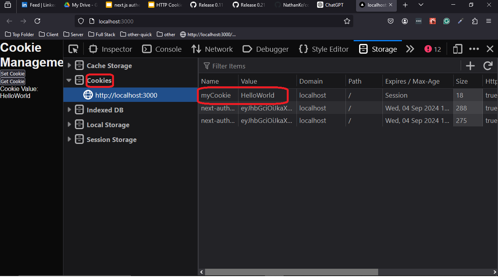

  <h1>Cookie Handling on the Server</h1>

<h2>What is a Cookie?</h2>
<p>A cookie is a small piece of data that is stored on the client’s browser by the server. Cookies are typically used to store user preferences, session tokens, or other information that needs to persist between requests. They are sent with every HTTP request to the same domain, allowing the server to remember the client’s state.</p>

<p>There are two types of cookies:</p>
<ul>
  <li><strong>Session Cookies:</strong> These cookies are temporary and are deleted when the user closes their browser. They are commonly used for managing sessions on websites.</li>
  <li><strong>Persistent Cookies:</strong> These cookies are stored on the user’s device for a specified amount of time. They persist across browser sessions and can be used to remember user preferences, authentication tokens, etc.</li>
</ul>

<p>Cookies can have properties like:</p>
<ul>
  <li><strong>HttpOnly:</strong> This ensures that the cookie is accessible only by the server and not via JavaScript.</li>
  <li><strong>Max-Age:</strong> Specifies how long (in seconds) the cookie should be valid before it expires.</li>
  <li><strong>Secure:</strong> Cookies marked as secure are only sent to the server over HTTPS connections.</li>
  <li><strong>SameSite:</strong> Controls whether the cookie is sent with cross-site requests, improving security and preventing CSRF (Cross-Site Request Forgery) attacks.</li>
</ul>

  <h2>Motivation of this repository</h2>
  <p>Experiment with setting and retrieving cookies on the server to understand how they work.</p>

  <h2>Setting a Cookie on the Server</h2>
  <p>The following example shows how to set a cookie on the server that will be sent to the client and stored in the browser's cookie storage:</p>

```ts
const name = COOKIE_NAME,
  value = COOKIE_VALUE;

// Set a cookie with a name and value. It will be accessible only via HTTP,
// meaning it won't be accessible through JavaScript (HttpOnly).

// This cookie will be sent to the server with every subsequent HTTP request
// made to the same domain that originally set the cookie.

// If the cookie with this name already exists, its value will be updated.
// Otherwise, it will be created as a new cookie.

// After COOKIE_MAX_AGE_MS milliseconds, the cookie will expire and be removed
// from the browser storage.

res.setHeader(
  "Set-Cookie",
  `${name}=${value}; Path=/; HttpOnly; Max-Age=${COOKIE_MAX_AGE_MS}`
);
```

  <h2>Behavior</h2>
  <p><strong>HttpOnly:</strong> The cookie is accessible only by the server, not by JavaScript on the client side.</p>
  <p><strong>Max-Age:</strong> Specifies how long (in milliseconds) the cookie should be valid. Once expired, the cookie will be removed.</p>

  <h2>Browser Storage Example</h2>
  <p>Once the cookie is set, it is saved in the browser's cookie storage, as shown in the example screenshot below:</p>
  
  

  <h2>Retrieving a Cookie on the Server</h2>
  <p>Cookies are sent by the client with every HTTP request. Here's how you can parse and retrieve a specific cookie on the server:</p>

```ts
const name = COOKIE_NAME;
const cookies = req.headers.cookie;

// Parse the cookies into key-value pairs
const cookieArray = cookies.split("; ").map((cookie) => cookie.split("="));
const cookieObject = Object.fromEntries(cookieArray);

// Retrieve the value of the specific cookie by its name
const cookieValue = cookieObject[name];
```

<h2>Key Points</h2>
<ul>
<li>Cookies are sent by the browser with each HTTP request to the same domain.</li>
<li>They are stored as a string in the <code>req.headers.cookie</code> field, which needs to be parsed to access individual cookie values.</li>
</ul>
